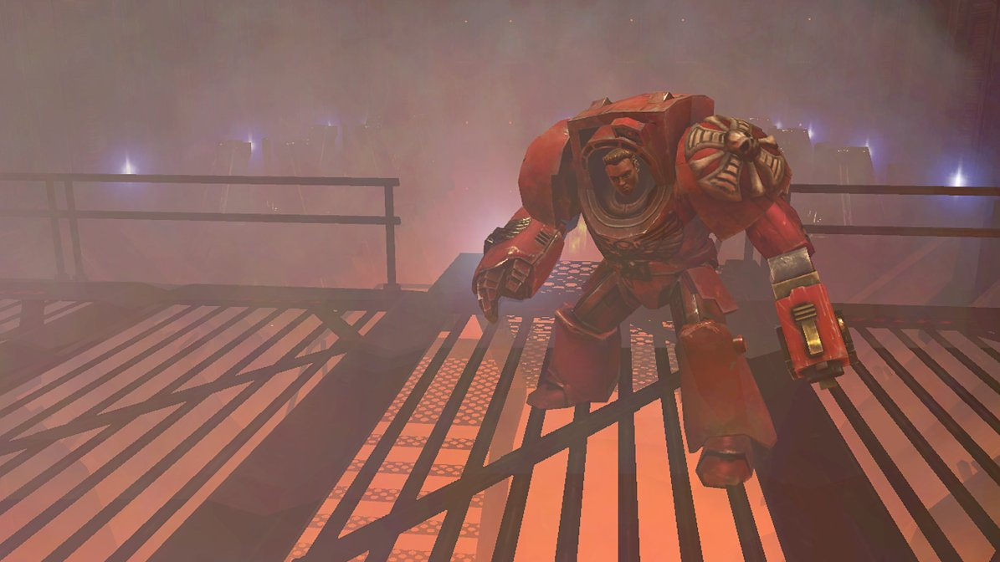
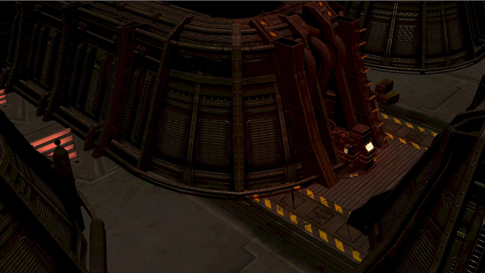
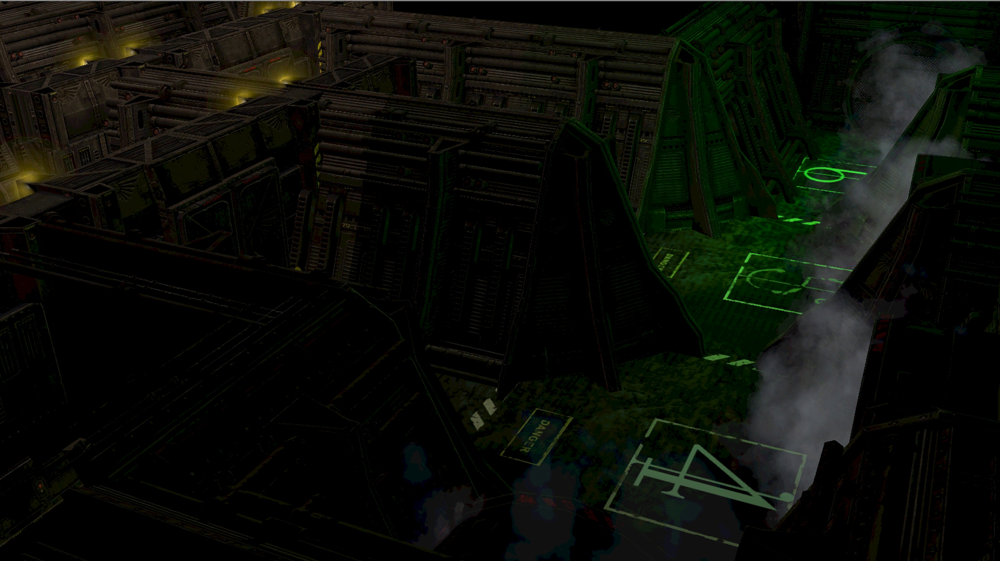
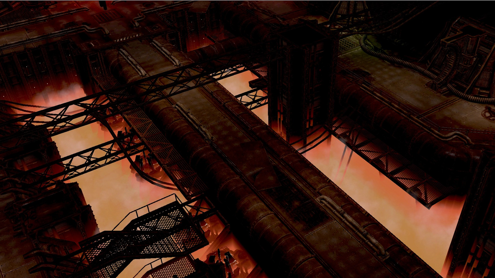
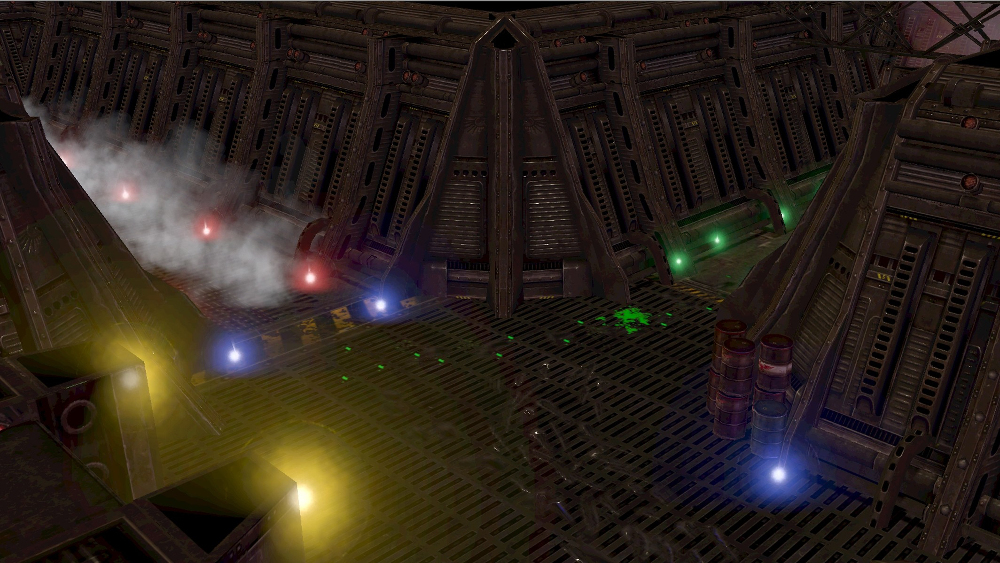

> In the depths of outer space, a huge block of vessels drifts in a vacuum.
> On board, the biggest threat in the history of mankind is being prepared.
> The Space Marines are responsible for cleaning the depths of the xeno abomination...

Back in 2010, this was my first coding project ever: to create a total conversion mode based on the **Warhammer 40,000 - Dawn of War II** game in order to reproduce the gameplay and feeling of the **Space Hulk** board game.

It was a big success because it made it to top #2 on ModDb (and still is #6,000 of #31,000 7 years later), was translated in 4 languages (french, english, italian and german) and it was featured in articles in several gaming magazines. The latest version was downloaded 20,000 times.

It featured and demanded:

- New gameplay and missions
- New models from other modders
- New maps
- Communication and promotion in forums and different websites
- LUA scripting
- Translation work
- Even the inclusion of a different soundtrack!

As a high school student it was an amazing project to work on and it was very rewarding. If you know the base game, here is a video of an in-dev multiplayer session that might interest you:

`youtube: https://www.youtube.com/embed/2supuKti_uA`
