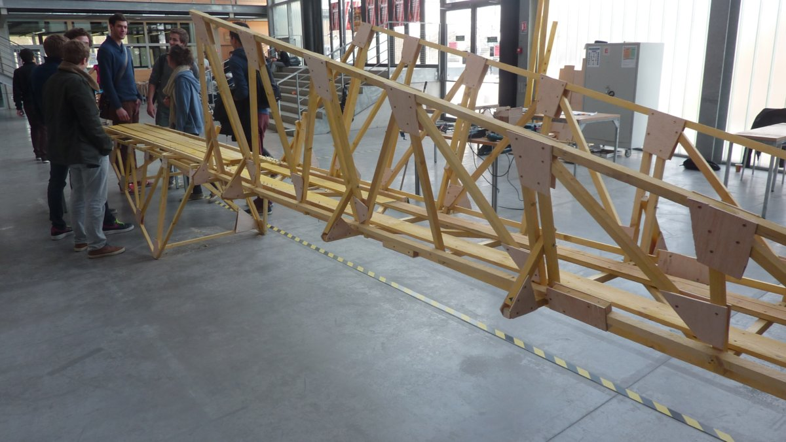
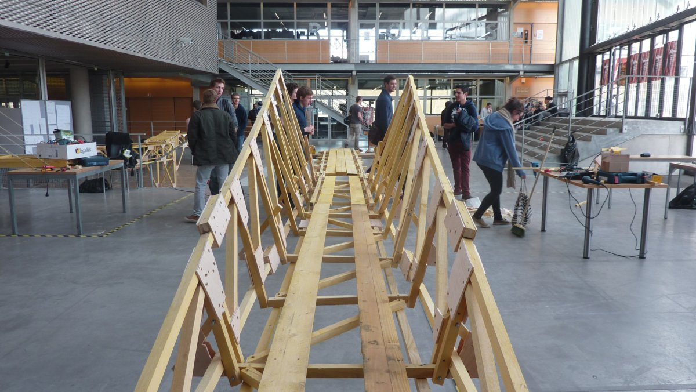

I was always interested in construction and architecture, that's why I chose the civil engineering cursus during my studies (and the École Nationale des Ponts et Chaussées is one of the best shcools in this domain).

One of my favorite courses was the design week, during which we were tasked to design and build something (in my case, a wooden bridge). We worked in teams of 6 (4 engineers, 1 architect and 1 designer) and the goal was to create a walkable bridge with some constraints:

- A minimum length of 7 meters
- A minimum span of 5 meters
- A clearance of 1 meter
- A limited quantity of materials
- A standard person could walk on the bridge… more than once

We chose to do an isostatic structure with a rotule in the middle - which later turned out to be the failure mode: the rotule broke after 7 crossings because we put a screw through a piece of wood of poor quality. At the end, this project was very fun and demanding. It allowed us to grasp the basics of structural engineering, modeling and bridge design.

For first year engineering students it was also the first opportunity we had to work with future architects and designers. For me it was also the confirmation that I like getting my hands dirty with manual work and carry the realisation of a project to the end.
