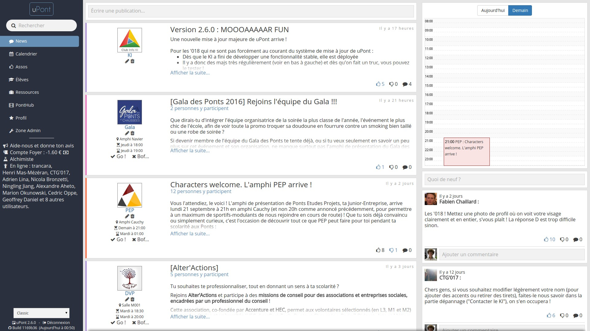
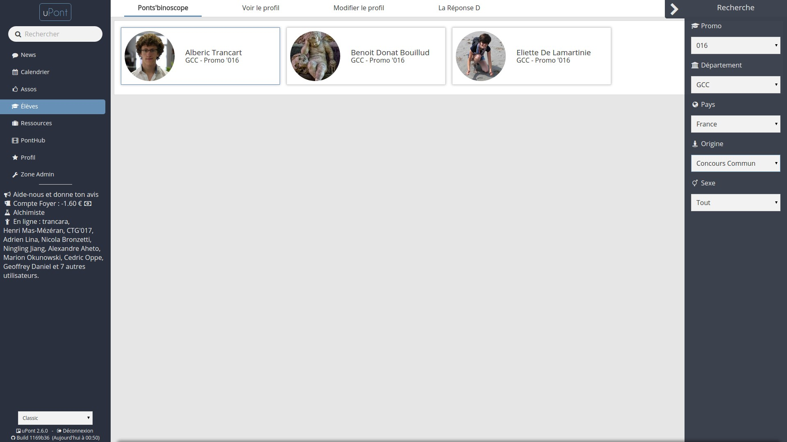
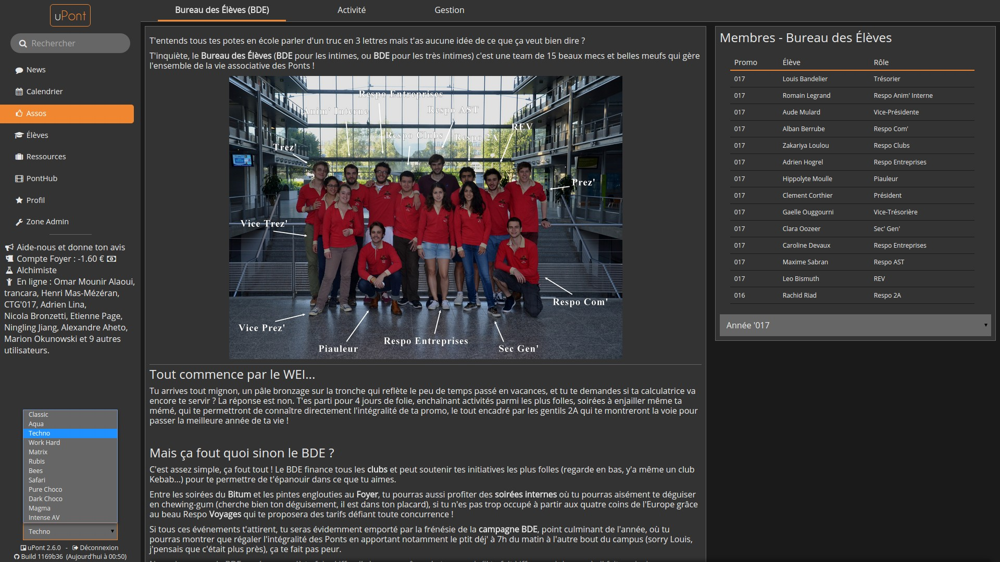

Back in 2014 during my first year at the École Nationale des Ponts et Chaussées, there was no intranet for the students. With a friend we decided to tackle this issue and we started building a website. It features a list of events organized by the student clubs (with automatic mailing if you follow a club), a directory to quickly find infos about other students, useful ressources, 12 themes, achievements and even a minigame.

This was my first big web project and we gathered around us a team of would-be developers. We used AngularJS (v1) as a front-end with a PHP Symfony back-end playing the role of a REST API. Here is the [GitHub repository](https://github.com/KIClubinfo/upont).

It was a great experience because I learnt the basics of the web dev toolkit (Git, Linux, Apache, Nginx, HTTP, the MVC architecture, REST, CSS and the BEM architecture, TDD, continuous integration, that JS was not limited to JQuery...) but it also teached me how to work as a team to make something loved by the end users.

We achieved a constant retention of 450 unique users each month, which is basically everyone on campus and more (there are about 350 students on campus and about 400 doing gap years and master degrees in foreign countries).
