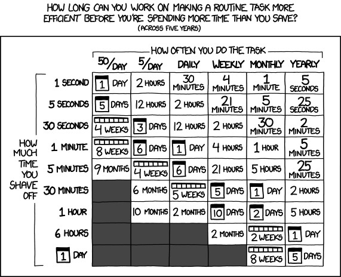
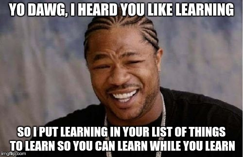

It's time for a first post! As an introduction, I would like to explain WHY I am doing this. This whole blog idea. This is a kind of meta-post that will serve as a guideline for the other ones, so let's do this!

## Never stop learning

> Anyone who stops learning is old, whether at twenty or eighty. Anyone who keeps learning stays young. The greatest thing in life is to keep your mind young. ~ Henry Ford

Almost two years ago, I started to realize that learning goes well beyond studies, and a great many things are not learnt at school. **Since then, I have an objective: to never stop learning. This decision had a huge positive impact:** I feel happier and I think that I have done more in two years than ever before. Before delving into the **How** and the **What**, I will emphasize the **Why**.

Most people see "The Plan" like this:

1. Go to school. Learn.
2. Get a degree. Stop.
3. ?
4. Profit.

However, there are two huge mistakes here: the scope of the skill set is very limited and the skill set does not grow after your mid-twenties. As a consequence, all does not go according to "The Plan". Then, the trial-and-error process of the human brain struggles to stick to "The Plan":

1. Make (very) bad decisions.
2. Try to fix the consequences.
3. Regret those decisions and wish you knew better.

Even trickier and scarier: there are mistakes you will not notice until your death-bed. Or you may not notice at all. Hopefully, it happens that there are (at the moment) around 7 billions people on Earth. For every mistake you make, a large group of people had a similar story. In this group, the chances that someone wrote/spoke about it are crazy high. Learning is the assimilation of the knowledge of others without all the cons. Why you should learn:

- **To make the right things** (to be _effective_)
- **To make the things right** (to be _efficient_)
- And this **in every aspect of your life**, be it professional skills, relationships, hobbies, existential questions...

## How and What

There are lots of media in order to achieve your goals. Obviously depending on the chosen topic, some are better than others but as a guideline, try to innovate with what you come up with and use different sources to enlarge the pool of available information. For instance, here are my media:

- Taking classes
- 
- 
- Following  bringing up [lots of different ideas](https://inside.com/dev)
- Going to meetups
- Using Google. [For. Every. Damn. Question.](https://www.google.fr/search?q=the+answer+to+life+the+universe+and+everything)

As for what to learn, you should already have some ideas (you always dreamt to learn a useful skill? Start now!) but you should look at:

- Teamwork. [Learn how to build a team](http://amzn.to/24HFRgD)
- Sharing your ideas. [How to speak in public](https://www.ted.com/talks/chris_anderson_teds_secret_to_great_public_speaking)
- Science. [The next challenges humans will face](https://waitbutwhy.com/2015/01/artificial-intelligence-revolution-1.html)
- How to learn. No joke. That's ultra-super-important. So important that
  it's the next thing I'll discuss.

## Learn how to learn

Let's go meta. Learning allow you to gather knowledge, but you want to do it faster that you would have done by doing the experiments yourself. There are three factors you want to improve with some tips:

- You want it **fast**: learn to read super fast/watch videos at 1.5x
  speed.
- You want it **dense**: if after 50 pages of a 400 pages book you gained zero knowledge or you aren't taking pleasure reading it, chances are high that it will not change with the last 350 pages. Please stop reading and take a better book. Do the same with presentations/talks/videos of poor quality.
- You want it **right**: share what you learnt and crave for feedback. Learning is a social activity! Discussing with other people will make THEM learn, and for YOU as you teach them/share your thoughts on the issue the knowledge will get more and more precise in your head.
- I'm sure you will find the tips & tricks that work well for you, the most important thing is to be aware of how important this skill is. As for me, this concludes my first blog post. Time to start sharing!
