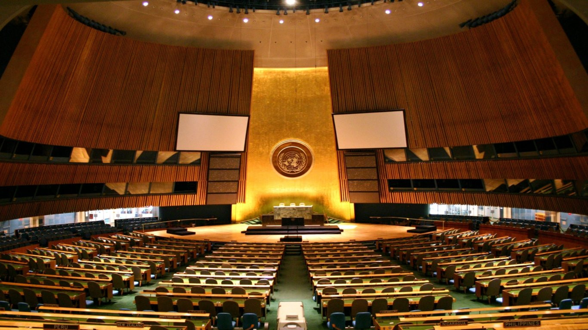
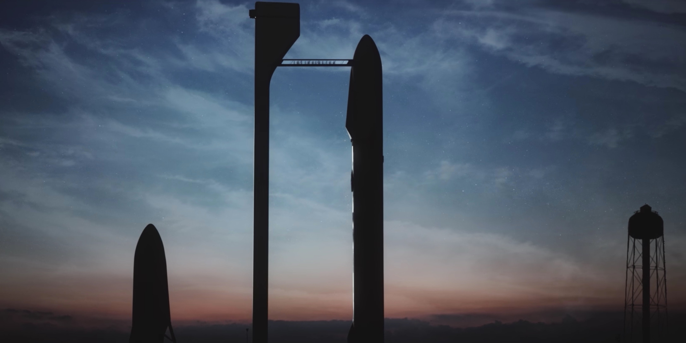

One week ago, [Elon Musk unveiled SpaceX's plans to colonize Mars](https://www.youtube.com/watch?v=H7Uyfqi_TE8), starting in 2025. Yep, you read that right. A lot of friends keep asking me tons of questions about this whole project, but the most recurrent one – and the hardest to answer – is: **why**?

## The defensive reason

When it comes to space exploration, there is an unbeatable-argument that space enthusiasts quote: do it to back up mankind on another hard drive, in order to prevent any Earth-level extinction event from wiping out humans… forever. This argument is very convenient because you can't deny its logic. As Elon Musk puts it:

> **One path is we stay on earth forever and there will be some eventual extinction event. [...] The other is to become a spacefaring and mutiplanetary species, which I think some would say is the right way to go – that's what we want.**

While it's easy to throw in this reason, most people will (rightfully) answer with "But why should I care? The probability of such an event make it far away in time for me". **So, let me make it very real for you and a lot more closer than you would have expected.**

At this point, I think you should understand why establishing a colony on another planet is important – you don't want to put all your eggs in one basket. Thus the goal is to expand beyond Earth... the next legitimate question as you've seen it, is not "How?" or "Where?" but **"When?"**.

There are three main reasons you want to do it sooner than later:

### Avoid procrastination

That's obvious. The procrastinator logic goes like this:

1. Why do it now? Will do later.
2. Why do it myself? Someone else will.

Sadly, we are 7 billions on Earth thinking exactly like this – because let's face it, [every one of us is a master procrastinator](http://www.ted.com/talks/tim_urban_inside_the_mind_of_a_master_procrastinator). There's also "Why do it at all? I have more pressing matters". As Tim Urban said:

> **It sounds to me like a person saying, "I'll worry about my health later when I don't have so many bills to pay." There will always, \_always \_be important problems to address on Earth, but if we allow what's urgent here to prevent us from addressing what's important in the big picture, we're allowing ourselves to take a huge existential risk.**

### There are always new ways to wipe out humans

In addition to cosmic-killer events like gamma ray bursts or rogue black holes or giant asteroids (which hopefully happen on astronomical timescales, quite literally), mankind is always inventing new ways to destroy itself. Actually, we are accidentally engineering [the sixth mass extinction event in Earth history](https://en.wikipedia.org/wiki/Holocene_extinction).

Nuclear apocalypse, biological weapons, Artificial Super Intelligence...those things are dangerously close and unhappily, the trigger can bepulled at any time because situations like these escalate quickly and arenot so foreseeable.

### The progress cognitive bias

Most people think of progress as a thing that automatically improves itself over time. That's a huge mistake. In fact, the truth is quite the opposite.

**There is only one stable point of technology level and it is zero**.

History has shown that great civilizations made huge technological advancements and then, at one point, the progress stopped, then fell back. The civilizations eventually collapsed some decades later. The most striking and well-known example is the one of the Western Roman Empire: it took about a thousand years before recovering a similar technological level at the end of the Middle Ages.

While progress or lack thereof do not always have a cause-consequence relation to civilizations falling, it is intimately correlated. And History repeats itself. In fact when it comes to space exploration we are already falling behind. We went to the Moon. Now humans are confined to Low Earth Orbit (LEO). At the moment, we are going into a future where humans will never make it to orbit.

The same goes for rocket technology: apart from some optimizations, we rely on the exact same techniques that were used 50 years ago… satellite building is taking off the shelf components that were designed 10 years ago, which means that most satellites in their mid-life are using technology 20 years older that what's on Earth.

**Because of these three points (procrastination, new Armageddons, technology level's equilibrium at zero) you should not see the issue as a deadline until the Apocalypse but as a set of windows. If we do not make life multiplanetary before the last window closes, we're done, even if the actual extinction event happens much much later.** One window opened in 1957 with the Space Race and closed in 1972 with the last Apollo mission. A new window has opened thanks to Elon Musk and SpaceX. From political obstruction to lack of will, there are multiple means those windows could be closed.

I find it very insightful that Stephen Petranek, in his talk [10 ways the world could end](https://www.ted.com/talks/stephen_petranek_counts_down_to_armageddon), discusses his n°10 hypothesis: "We lose the will to survive". Depression rhymes with stagnation. If no one pushes the envelope we will collapse, as depicted in Isaac Asimov's Foundation novels. Pushing the envelope, that's exactly what SpaceX is doing and my wild ass guess is that Elon Musk's biggest fear is _"Will we make it before I die/this window closes?"_.

Given that space is cray hard, colonizing other solar system bodies in a sustainable way might take more than 50 years, and the window can close at any moment during the project. We may even be too late. Don't misunderstand me: we are not leaving Earth because it is awful. Earth is great. We just need to buy a life insurance. But so far we talked of the not-so-happy reasons. There are tons of reasons you want to explore space.

## Economy

That one is almost brought up in every space exploration discussion so I'll address it first.

Musk claims that developing the hardware to colonize Mars will cost around 10 billions dollars. Best guesses say it will cost around 500 billions dollars to build an autonomous colony of over 80,000 people. Sure, initial costs are crazy high. In the far future, it can be repaid by launching Earth satellites from Mars, mining asteroids ([we're talking about huuuuuge money here](https://en.wikipedia.org/wiki/Asteroid_mining#Potential_targets)) or exporting some deuterium for eventual nuclear fusion reactors. But that's far in the future and at this point the colony will surely be self-sustaining.

A self-sustaining colony would have its own economy therefore the economic advantages may not fall back to Earth in such a trading way, everything would have its price. The naysayers talk about the funding of this whole venture but since SpaceX is a private company\*, that will come in the "How?" part, not in the "Why?". That's the reason I think this argument is mostly irrelevant, at least in this particular case.

**Most of those naysayers will argue that SpaceX is funded by taxpayers, which is ultimately true but not in the way you might expect. You are funding SpaceX more when you pay your internet bill than when you pay your taxes: commercial satellites is a much bigger market than science payloads, which funding could be cut at any moment by the American congress.**

[In this excellent speech by Michael Griffin,](http://www.spaceref.com/news/viewsr.html?pid=23189) the former Administrator of NASA makes a distinction between what he calls the "Acceptable Reasons" and the "Real Reasons". He makes an analogy in which the space industry is like the cathedral builders of the Middle Ages. Cathedrals were done for the "Real Reasons", but in the end they also served the Acceptable ones.

> **If things are done for the Real Reasons that motivate humans, they also serve the Acceptable Reasons. In that sense, in the practical sense, space really is about spin-offs, as many have argued. But it's not about spin-offs like Teflon and Tang and Velcro as the public is so often told – and which in fact did not come from the space program. And it's not about spin-offs in the form of better heart monitors or cheaper prices for liquid oxygen for hospitals. Yes, you get those things and many more, and they are real benefits. But that's not the right level on which to view the matter. The real spin-offs are at a higher level. We need to look at a broader landscape.**

The Real Reasons cannot be taken into account in a cost/benefit analysis. That's why I say economic arguments are not relevant. The basic economy course tells you that if you want to get leverage on the long-term growth, you must invest in education, science and technology, but the benefits will be hardly quantifiable. We've seen the Doomsday-argument and solved the economic one. Those were Acceptable Reasons. So let's talk about the Real Reasons.

## The Real Reasons

### Do it for science!

Apart from advances in rocket science, space exploration is about:

- Planetary science: to explore another celestial body will enable us to better understand the process of planet birth and how they behave over geological timescales
- Biology: even if we don't find life on Mars, defining what life exactly IS is a tough necessary step
- Ecology: space colonization will need efficient life-support systems and recycling that could be reused on Earth. For Mars we will likely need 99% recycling efficiency
- Astronomy: observing the skies would be easier if telescopes were put in the "clean skies" of Mars or if space probes could be sent from there
- Meteorology: believe it or not, [Mars also has a weather and seasons](https://en.wikipedia.org/wiki/Climate_of_Mars). Studying it will confirm an refine the laws we have defined for Earth meteorology. Furthermore, a better understanding of planet-scale global warming will be an obligatory step towards terraforming
- Speaking of terraforming, we will also need chemistry, hydrology and geology (or is it _ares-ology_?)

All of these fields would see tremendous benefits from Mars colonization but in my opinion that's not the greatest advantage of space exploration. Back in 1969, the Moon landing inspired a whole generation to start a career in science or engineering. **Space colonization would be a huge boost to science education.**

### Politics

While the Space Race cannot be considered as a success on the political level, space exploration makes countries work together: 18 countries helped build the International Space Station, even when some of those cannot bear each other. Colonization will strengthen and multiply these bonds because of the sheer scale of the project (and that will not be another Space Race).

Furthermore, the last time people were able to choose their political system was in 1776 when the colonial states in the New World formed the USA. **Colonizing another place far away from Earth will give us a new shot to build a better political system, a clean sheet to start anew.**

Besides, playing politics on this level will incite world leaders to take unified decisions on a planetary scale and help them renforce the necessary institutions. A great step towards world peace?

### Philosophy

Investigating the mysteries of life and seeing humans as a space-faring species will inspire new ideas. In addition, it will raise healthy debates: do we have the right to colonize space? should we terraform a planet? what would be the means to achieve a better society?

### Art

From the artistic point of view, Mars and space have already inspired handfuls of novels, movies, images and even music. Imagine what will burst when we do actually get there. Artists will be inspired by new beautiful landscapes and this new sense of freedom. I don't even talk about mainstream TV series and awesome reality TV shows that will flood the Youtube/Netflix of the future.

### Sports

I let you imagine what could be done in 0.3g. Mars has one-third the gravity of Earth, which implies running faster than Usain Bolt (although stopping is not that easy), jumping so high you could start flying with carbon fiber wings, kayaking down slow-motion arced waterfalls… another consequence of low gravity is that you will have the sleep of your lifetime (your own weight restricts blood flows a lot less and lungs move easier). Also, no more snoring! (this one neat fact is a sufficient reason to get to Mars)

## The New Frontier

This last reason is the one I found the most appealing. For some of you it will be less mind-blowing but deep inside us, **the insatiable human curiosity craves for new lands to explore**. There is nothing more exceptional to conquer on Earth nowadays. Space is the New Frontier. On Mars there's a whole new planet of unexplored surface (as much as all Earth's continents combined) waiting to carry your human footprints, your habitat, your name. But Mars is only the first step. We are wanderers. We need places to wander.

`youtube: https://www.youtube.com/embed/YH3c1QZzRK4`

Also, there is that monument building thing. **We need a reason to live by.** This could be one good candidate. What will be our generation's legacy? Will our descendants look back on us and say "those were great times", or "that was a time of depression and stagnation – I'm happy I wasn't there".

Making humans a multiplanetary species would be the greatest achievement of Mankind – the first one on the geological timescale\*, dwarfing Christopher Columbus's discovery of the Americas by multiple orders of magnitude. I don't know about you but thinking it could happen during our lifetime is the coolest thing ever. _Well, at least, the first **good** one. The first one would be this sixth mass extinction event we're engineering._

Now, I think you should be convinced that going to Mars is a good thing. At least, that this whole venture is not the pointless dreams of crazy billionaires. Even if you don't believe it will happen during our lifetime, you can understand why some people are trying hard to get us there. **If you can understand the "Why?", I have achieved my goal.**

"How?" SpaceX will fly us to Mars? Their plan comes into two parts: a Big Fucking Spaceship on top of a Big Fucking Rocket. Don't misunderstand me, this journey will be hard. The hardest ever been undertaken. [But that's a story for another day.](/2019/08/spacex-starship-the-rocket-that-will-make-history-explained-in-5-minutes)

### Sources and inspiration:

- [Making humans a multiplanetary species](https://www.youtube.com/watch?v=H7Uyfqi_TE8)
- [Space Exploration: Real Reasons and Acceptable Reasons](http://www.spaceref.com/news/viewsr.html?pid=23189)
- [Why should we go to Mars?](https://www.reddit.com/r/spacex/comments/4x3aos/why_should_we_go_to_mars/)
- [How (and Why) SpaceX will colonize Mars](http://waitbutwhy.com/2015/08/how-and-why-spacex-will-colonize-mars.html)
