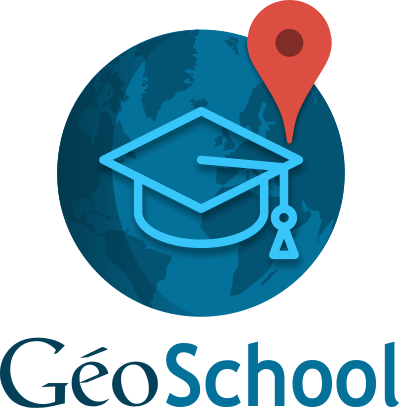
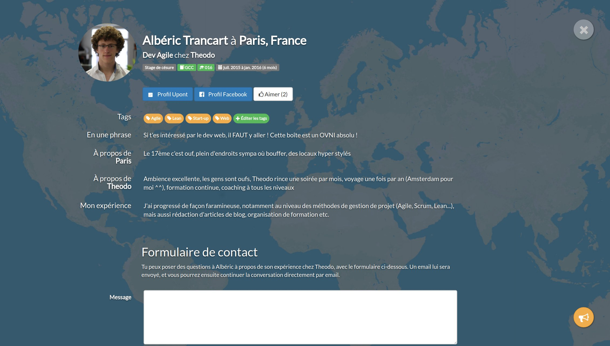
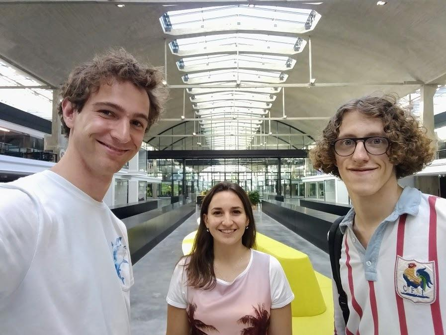

In 2015, a friend of mine had a problem: he was looking for an internship in Sweden and seeking feedback from people who went there. Although these people existed and surely met him on a daily basis, he was unable to find them.

He decided to gather useful information (like: who went where, the cost of living, the temperature, the price of a beer... **useful information**) with a Google Sheet and it had a huge success. He decided to create a web platform to centralize and search through this data. GéoPonts (named after the name of our school) was born.

Later, the platform was gaining a lot of traction so he decided to go fulltime on it. Another alumni of our school and I joined the project soon after. GéoPonts became GéoSchool. Today, we are deploying these platforms in french engineering schools, helping the students building their professional project and puting them in relation with cool companies they didn't even know.

This is an ongoing project but so far it is one of the best working experience I ever had: I learnt a lot of things about data-driven product design, entrepreneurship, scaling and doing the architecture of a web platform, business strategy and even the basics of recruitment.

On top of that, we are working in Station F, the world's biggest startup campus created by Xavier Niel. This amazing place is the perfect one to meet fellow entrepreneurs and learn a lot about all the needed skills.

**Update:** as of today, we decided to end the project. You can read [our final conclusions in this blog post](https://www.geoschool.fr/) (link in French).
