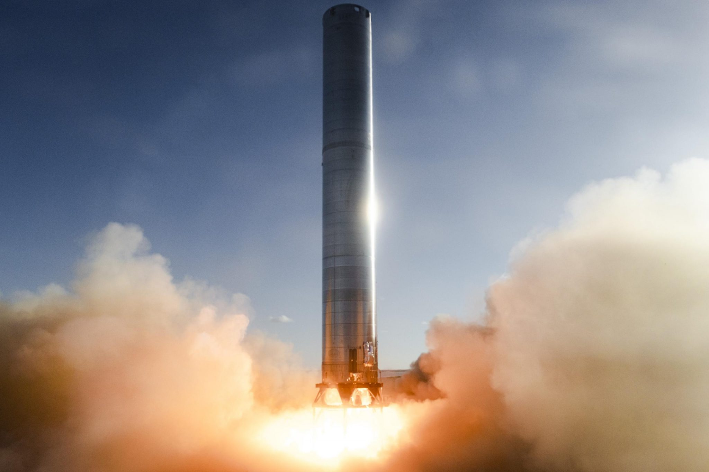
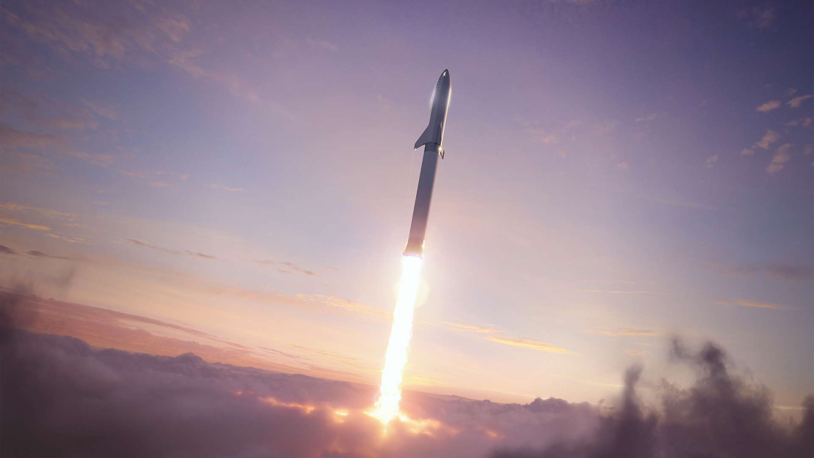
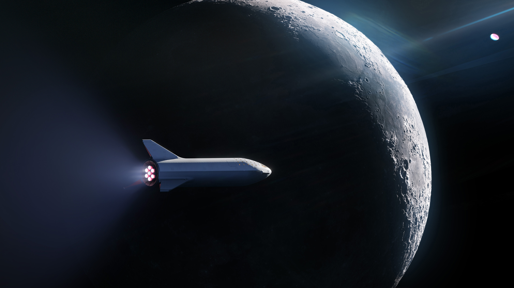
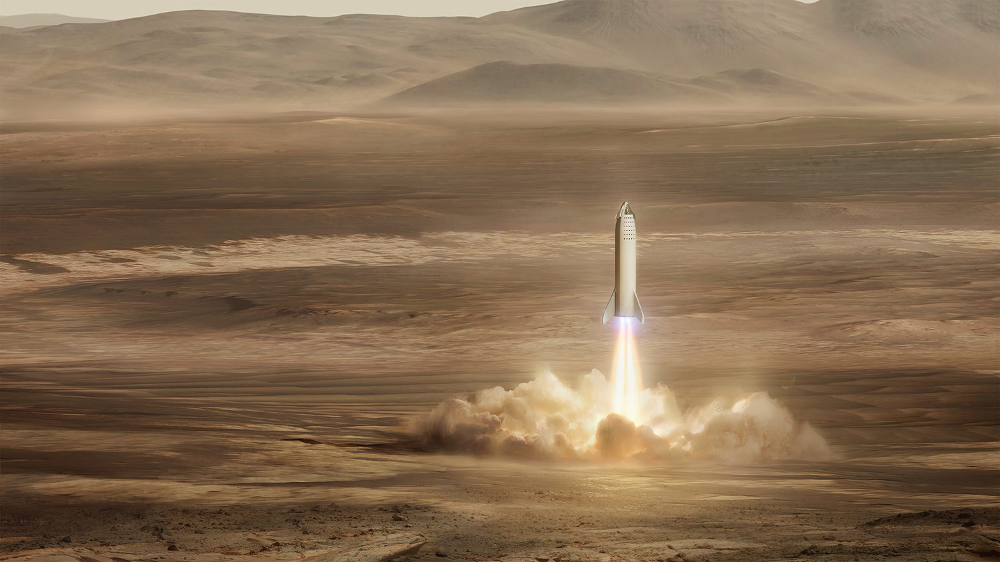
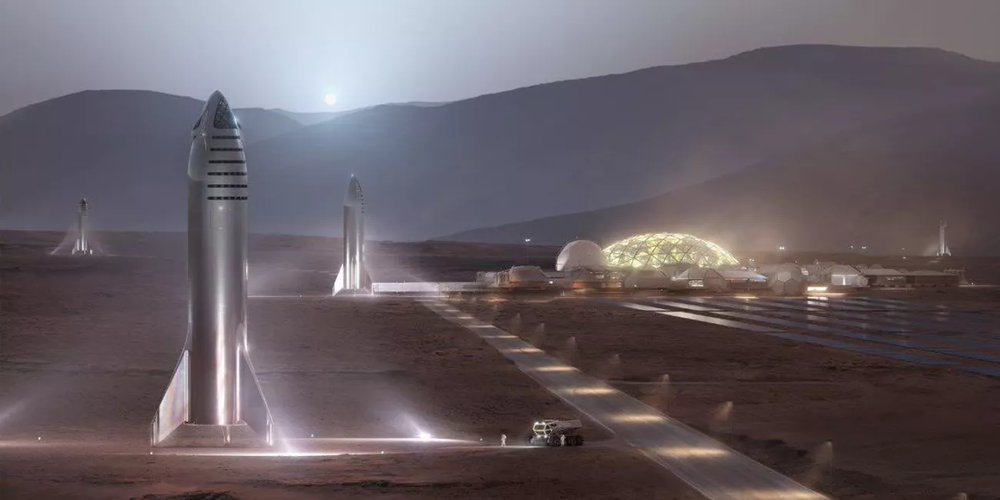

We are on the brink of a revolution in space travel tech. It is my pleasure to share the excitement by explaining what it is, why it is important, how and when it will happen. This one will be in the history books, so you better learn about it!

## What it is

Starship is SpaceX's next gen rocket, currently under development. You may have heard of it under its codename BFR, which stands for _Big, Fucking, Rocket_. Being 118 meters tall, **it will be the biggest and most powerful rocket in history**. Bigger and more powerful than the Saturn V, the rocket that brought the Apollo missions to the Moon.

 size comparison")

The Starship rocket system is made of two parts:

- At the bottom (under the black separation line), the first stage which is called the Super Heavy booster. Its role is to accelerate the second stage out of the atmosphere.
- At the top, the second stage - the Starship itself. It will come in two flavors: one cargo version for transporting satellites and one crewed version to send people in outer space.

## Why it is important

Three awesome things about this rocket:

- _It can lift a lot at once._ Current rockets can lift about ~20 tons to Low Earth Orbit, whereas **Starship will be able to lift more than 100 tons** to the same orbit.
- _It runs on methane._ Methane is a fuel that can easily be manufactured on Mars with basic chemical reactions, which means that **if you land a Starship on Mars, you can return to Earth for free by producing methane there.**
- _It will be dirt cheap._ Right now, you can send things to space for about \$5,000/kg. **Starship aims to bring that figure to as low as \$50/kg.**

With launch costs being 100x cheaper, a lot of sci-fi things become
possible:

- A permanent scientific base on the Moon - imagine your child doing a PhD at Moon Base Alpha, joining the 1,000 other scientists there for a two-year stay
- A Mars colony - you regularly exchange video messages with your friend who sold his house to move to another planet and start a new life
- Space tourism - you can see Earth from space for the price of a premium airline ticket
- Probes and landers to destinations which have tremendous scientific value - you can watch high-resolution documentaries about Enceladus' underground oceans or Titan's cryovolcanoes
- And a lot more...

## How it works

Now is the time to ask: how is it even possible??? How can Starship achieve such a low cost access to space? The key word is:

_Reusability._

Rocket stages are usually single use: they are thrown into the ocean after delivering their payloads to orbit. With Falcon 9, **SpaceX has already proven that landing rocket boosters and reusing them is possible _and_ profitable.** However, the company has only reused first stages so far, which means that a lot of costly parts must still be manufactured for each launch.

**Contrary to Falcon 9, Starship is big enough and has enough fuel margins that it will be possible to recover and reuse both stages**, making it the first 100% reusable rocket system in history. With airplane-like reliability, the only real cost is the fuel - about ~$500,000 for a fully-fueled Starship. Amortize the manufacturing cost of both stages over 100 launches, add some margins and you get the $5,000,000/100 tons or \$50/kg price tag to Low Earth orbit.

## Timelines

The best thing is: **all of this is going to happen way sooner than you think**. The SpaceX team is hell-bent on landing a Starship on Mars by 2026. To achieve this goal, they are moving really, really fast. Here is an updated timeline of what has happened and is happening right now regarding Starship development:

### Phase 1 - Raptor engine development - DONE

The Raptor engine is the rocket engine that powers Starship. They are _super high tech_ by rocket engine standards and Super Heavy/Starship will have more than 40 of them. As it's the single most complicated system in the rocket, its development began around 2012. After a lot of testing, **Raptor has entered mass production in 2019.**

### Phase 2 - Starhopper low-fidelity prototype - DONE

To test its Raptor engine in real flight conditions, SpaceX contracted a water tower company to rapidly assemble a working Starship prototype. This prototype made hops (the highest at 150 meters) **and allowed SpaceX to validate the engine control and landing algorithms**.

`youtube: https://www.youtube.com/embed/bYb3bfA6_sQ`

### Phase 3 - Starship prototypes - DONE

The next step was to launch Starship prototypes to test landing trajectories to prove that second stages can also be safely recovered and reused. SpaceX also setup a factory in Boca Chica, Texas to crank out Starship vehicles. **After 4 failed landing attempts, SpaceX successfuly landed Starship SN15.**

`youtube: https://www.youtube.com/watch?v=z9eoubnO-pE`

### Phase 4 - First orbital launch - HAPPENING RIGHT NOW

SpaceX is targeting an first orbital launch to test the reentry of the vehicule in the upper atmosphere and validate the heat shielding technology. It will also feature the first use of the Super Heavy booster.

### Phase 5 - First commercial launch - 2022

SpaceX is already in talks with three potential customers for a commercial satellite launch. This will be a big milestone, because **it will mean that Starship is already cheaper and better than the Falcon 9**. Also, it will make the rocket pay for itself (which is an achievement, considering the size of the thing).

### Phase 6 - First crewed trip around the Moon - 2023

After that, the next challenge will be to develop the crewed version and send people with it. **Yasuka Maezawa, a Japanese billionaire, has already bought the first Starship crewed flight to go around Moon with artists** (a film director, a musician, a painter, a fashion designer...). He's also paying a good chunk of the development cost.

### Phase 7 - First landing on Mars - 2024

While Starship will be used to execute most SpaceX missions, two cargo Starships will be retired and launched towards Mars. **The goal will be to prove that Earth landing technologies also work on Mars.**

### Final phase - First human footprints on Mars - 2026

By 2026, Starship should have dozens of successful flights under its belt in the near-Earth space. **SpaceX's goal is to land two cargo and two crewed Starships on Mars in five years.** After that, the rest should be history.

## My take on the subject

A Moon base and Mars colony in our lifetimes? _Sure as hell it will happen!_ But obviously, the 2026 goal seems really ambitious. I think the crewed version will take longer to develop as human-rating a rocket system for a 3-year journey will not be simple. **My bet is that the first cargo Starship will land on Mars in 2024 and that the first human footprints will happen before 2030.**

But thus far, SpaceX is on time according to the original timeline revealed in 2016. What you need to know is that _their internal schedule is even more ambitious than this official timeline!_ I'm not holding my breath, but they are the ones who already made the impossible possible by landing a rocket and reusing it profitably.

## If you want to...

- Ask any question, you can tweet them [@alberictrancart](https://twitter.com/alberictrancart)
- Know more about Starship, Raptor engine or anything related to rocket science, [here is a great Starship compendium](https://www.elonx.net/super-heavy-starship-compendium/)
- Stay up to date with Starship infos, the [r/spacex](https://www.reddit.com/r/spacex/) Reddit community is the best resource but you can also follow me on Twitter ;)
