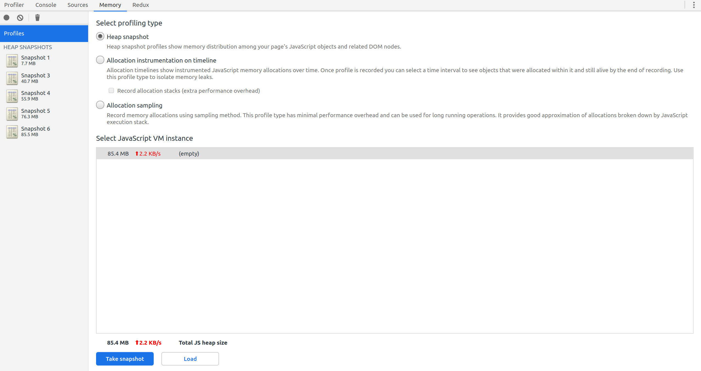
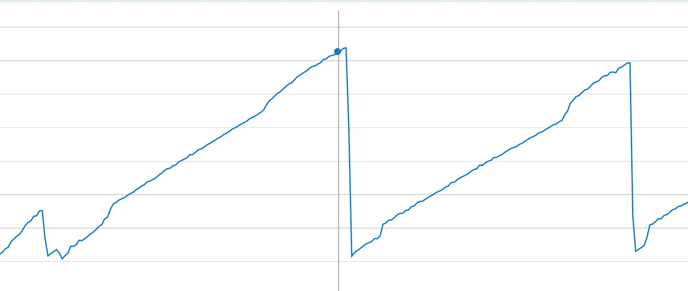
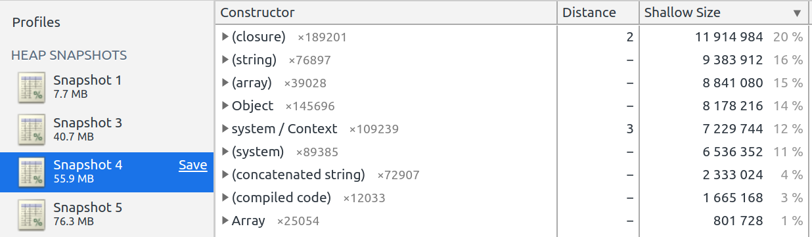
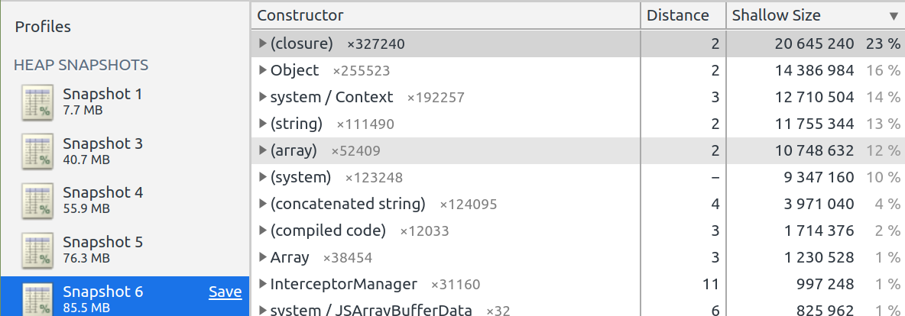
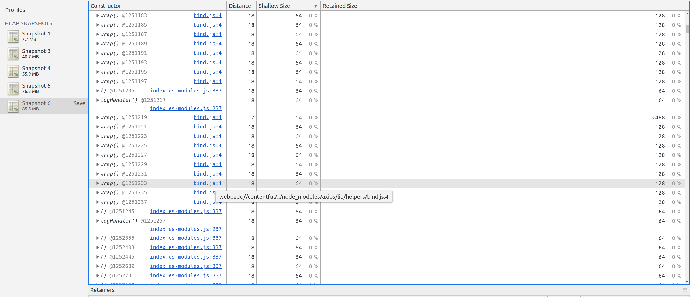
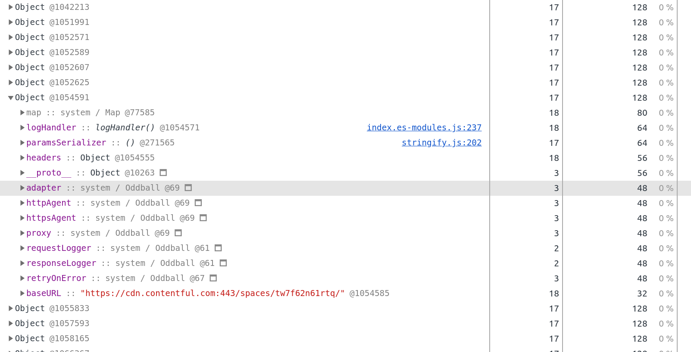
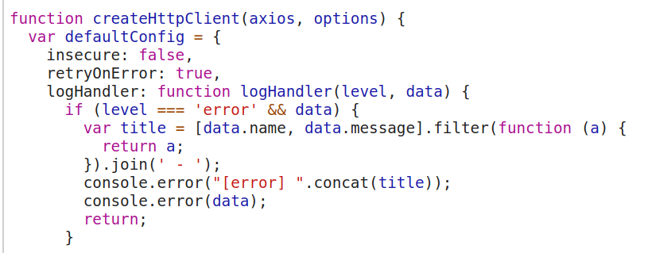

Last week I had to debug my first memory leak: our server crashed at regular interval and the memory usage chart showed that it used all the available memory before needing a restart.

I dreaded this moment because of the almost mystical nature of "memory leak" in the software development vocabulary... but I found it actually quite easy to debug on NodeJS with all the tooling available.

All of this would not have been possible without this great tutorial from Marmelab [How to track and fix a memory leak with NodeJS](https://marmelab.com/blog/2018/04/03/how-to-track-and-fix-memory-leak-with-nodejs.html).

Here's how went the investigation:

## Setting up the local environment

First things first, I tried to reproduce the error on my computer.

- I built the JS bundle in prod mode (`yarn build`)
- I started the Next server using the Node v8 debugger by adding `NODE_OPTIONS='--inspect'` just before the `yarn start` command
- Once the server was started I went to `chrome://inspect` to inspect the NodeJS process with the classic Chrome devtools. It worked out of the box!

Then I did some load testing with this simple bash script found on the Internet:

```bash
max="$1"
date
echo "url: $2
rate: $max calls / second"
START=$(date +%s);

get () {
  curl -s -v "$1" 2>&1 | tr '\r\n' '\\n' | awk -v date="$(date +'%r')" '{print $0"\n-----", date}' >> /tmp/perf-test.log
}

while true
do
  echo $(($(date +%s) - START)) | awk '{print int($1/60)":"int($1%60)}'
  sleep 1

  for i in `seq 1 $max`
  do
    get $2 &
  done
done
```

With that I could load the server with 25 requests/second using `./load.sh 25 "http://localhost:3000/"`.

With the Chrome DevTools I went to the Memory tab and took 4 snapshots of the memory heap:

- One before any testing, with just the server loaded
- One after a 100 seconds stress test
- One after a 50 seconds stress test
- One after another 50 seconds stress test

Each snapshot was took after waiting ~2 minutes to allow for the server to process all remaining requests and after triggering garbage collection through the Chrome DevTools (bin icon at the top left).

Here are the results:



**There's a leak!**

Good news: the bug is now reproducible in the local environment.

## "They did the maths": scientific check of what we've found

Our app seemed to be leaking at a rate of ~15 MB for a 50s load test (as you can see it's only an approximation here), so 1250 requests. Thus it takes ~83 requests to leak a single MB.

Checking our Azure app monitoring, we found that the app leaks at a constant rate:



The app leaked ~1200 MB between 1:17 am and 9:27 am, so 590 minutes. After some investigation, we learnt that Azure makes health check calls at a rate of 100 requests/minute.

Thus it took 59k requests to leak 1200 MB, so the app leaks a single MB every ~50 requests. That's the same order of magnitude as the ~83 requests needed in local.

The difference here could be explained by the small sample taken in local (only 3 data points with a 20MB, 15MB and 10MB leak).

What's important is that **it is the same order of magnitude: we are solving the right issue.**

## Finding the leak

Inspecting the 3 different heaps and sorting by Shallow size revealed that we were leaking closure and Object variables.







We were leaking about ~4.5 MB from closures, ~3.2MB from Objects and the rest from other variables.

If we check the Retained size (the size of the object + all its children in the graph), we can see that all the leak can be attributed to the closures, which makes sense: and anonymous function will create other objects.



If we inspect the closures, we see that almost all the retained ones come from the Contentful library. If we inspect the leaked Objects, we see that the most frequent object is a Contentful config:



The related code in the lib is here:



Then it was not difficult to find the faulty code in our app:

```tsx
const getContentfulClient = () => {
  if (!process.env.CONTENTFUL_SPACE || !process.env.CONTENTFUL_TOKEN) {
    throw new Error('Contentful secrets are not set');
  }

  return createClient({
    space: process.env.CONTENTFUL_SPACE,
    accessToken: process.env.CONTENTFUL_TOKEN,
    environment: 'master',
  });
};

const getContentfulEntries = async <T>(
  contentType: string,
  locale?: string,
): Promise<Entry<T>[]> => {
  const firstResponse = await getContentfulClient().getEntries<T>(...);
  ...
}
```

We were creating a Contentful client on each request, but the client provided by the lib seemed to survive the request, eating up the NodeJS server memory.

## Fixing the issue

The fix was simple: instantiate one client at server start and use it for all requests.

```tsx
// DO NOT USE THIS FUNCTION MORE THAN ONCE
// The contenful lib does not shutdown the client at the end of
// the request so it causes a memory leak if called on each request
const createContentfulClient = () => {
  if (!process.env.CONTENTFUL_SPACE || !process.env.CONTENTFUL_TOKEN) {
    throw new Error("Contentful secrets are not set");
  }

  return createClient({
    space: process.env.CONTENTFUL_SPACE,
    accessToken: process.env.CONTENTFUL_TOKEN,
    environment: "master",
  });
};

let contentfulClient: ContentfulClientApi | null = null;
const getContentfulClient = () => {
  if (contentfulClient === null) {
    contentfulClient = createContentfulClient();
  }
  return contentfulClient;
};
```

Here is the result with the same load profiles:


**Memory leak fixed! 🎉🎉🎉**

## Conclusion

I feared the word "memory leak" because it seemed almost like magic... however magic does not resist to great tooling and a rational and constructed approach.

Where you see magic, the hammer of the scientific method must fall hard. [Like CSS.](https://blog.theodo.com/2018/06/write-better-css-part-1/)
