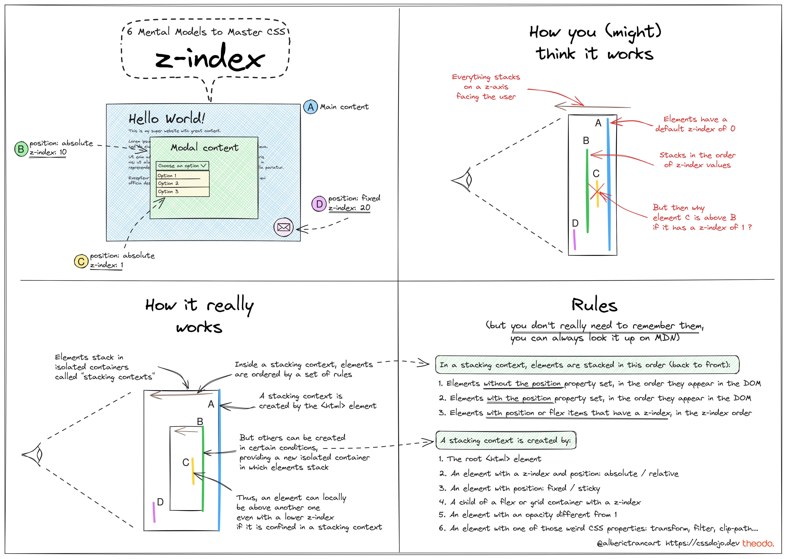
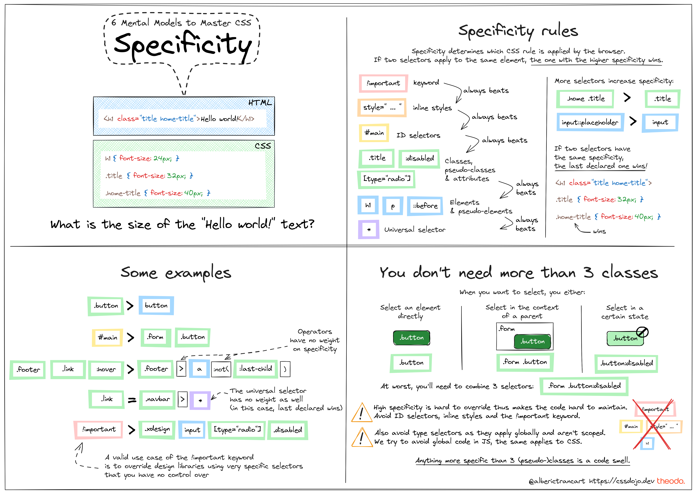
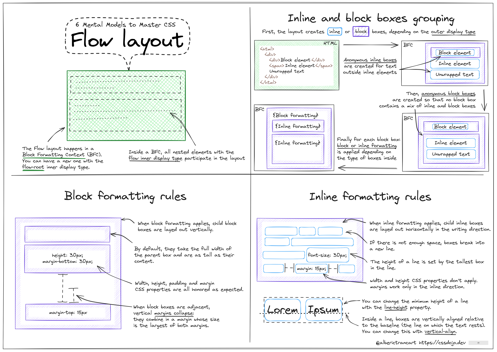
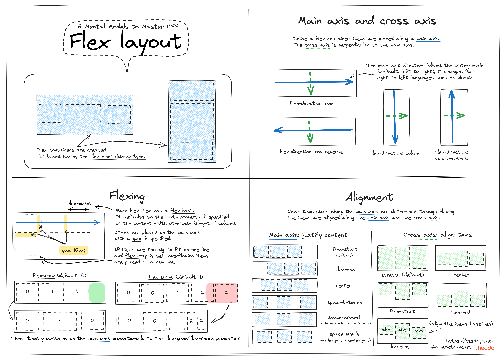
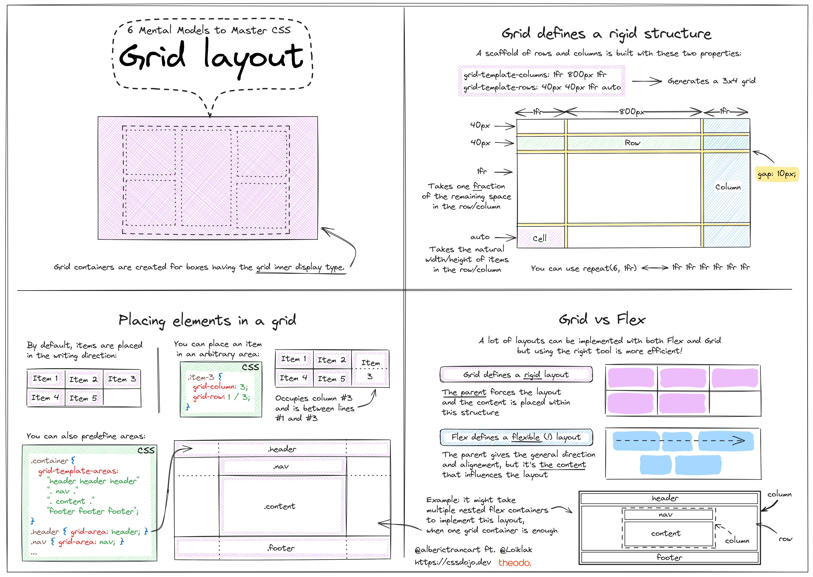

**What do you actually need to master CSS?**

From years of experience talking to devs about CSS, there are 6 major pain points that need to be adressed.

**I made 6 mental models that tackle each pain point.** You can even print them and pin them on the wall!

I hope they'll be useful to you too.

PS: you can click on each image to see a full resolution version.

